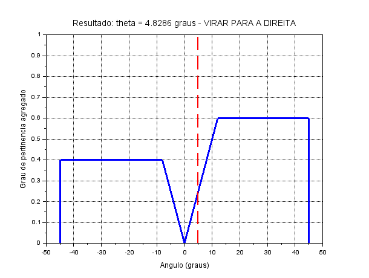

# Controle Fuzzy para Desvio de Obstáculos em Robótica Móvel

Este projeto implementa, no Scilab, um sistema de inferência fuzzy Mamdani que calcula o ângulo de correção de um robô móvel a partir da distância frontal e da assimetria entre sensores laterais.

**Autor:** Fernando Roque Caldas de Oliveira  
**Matrícula:** 202211130038  
**Disciplina:** Automação Inteligente

## Variáveis

### Entrada 1 - Distância frontal

- Universo: `[0, 100] cm`
- Termos: Perto, Média e Longe

### Entrada 2 - Assimetria lateral

- Definição: `a = d_dir - d_esq`
- Universo: `[-50, 50] cm`
- Termos: Negativa, Zero e Positiva

### Saída - Ângulo de direção

- Universo: `[-45°, 45°]`
- Termos: Virar à Esquerda, Seguir em Frente e Virar à Direita

## Base de regras

| Distância \ Assimetria | Negativa | Zero | Positiva |
|---|---|---|---|
| Perto | Virar à Esquerda | Virar à Direita | Virar à Direita |
| Média | Virar à Esquerda | Seguir em Frente | Virar à Direita |
| Longe | Seguir em Frente | Seguir em Frente | Seguir em Frente |

O conectivo E, a implicação e a agregação usam, respectivamente, mínimo, mínimo e máximo. A defuzzificação usa o método do centroide.

## Requisitos

- Windows 10 ou Windows 11 de 64 bits
- Scilab 6.1.1 de 64 bits
- sciFLT 0.5

O trabalho utiliza somente o Scilab como ambiente de implementação e simulação.

## Localização dos arquivos no Windows

Pasta completa do projeto:

```text
C:\Users\ferna\Desktop\01 - Faculdade\AUTOMACAO
```

Arquivos e pastas principais:

```text
C:\Users\ferna\Desktop\01 - Faculdade\AUTOMACAO\fuzzy_robotica.sce
C:\Users\ferna\Desktop\01 - Faculdade\AUTOMACAO\fuzzy_robotica.fls
C:\Users\ferna\Desktop\01 - Faculdade\AUTOMACAO\relatorio_atividade_3A.tex
C:\Users\ferna\Desktop\01 - Faculdade\AUTOMACAO\relatorio_atividade_3A.pdf
C:\Users\ferna\Desktop\01 - Faculdade\AUTOMACAO\prints
```

## Como executar

1. No Windows, abra o Scilab 6.1.1.
2. No SciNotes, abra `fuzzy_robotica.sce` pelo caminho informado acima.
3. Pressione `F5` ou escolha **Executar > Executar arquivo**.
4. O programa criará `fuzzy_robotica.fls`, `resultado_simulacao.txt` e as imagens da pasta `prints`.

Também é possível executar no console:

```scilab
cd("C:/Users/ferna/Desktop/01 - Faculdade/AUTOMACAO")
exec("fuzzy_robotica.sce", -1)
```

## Resultado do teste

Para `d = 10 cm` e `a = -10 cm`, são ativadas as regras Perto/Negativa e Perto/Zero. O sciFLT calcula aproximadamente `4,8286°`. Como o ângulo é positivo, o robô deve virar para a direita.

O cálculo manual, discretizado em passos de 5 graus, resulta em aproximadamente `5,1190°`. O valor do software pode diferir levemente porque usa 1001 pontos na defuzzificação.



## Estrutura

```text
fuzzy-robotica-desvio-obstaculos/
├── README.md
├── calculo_manual.md
├── fuzzy_robotica.sce
├── fuzzy_robotica.fls
├── relatorio_atividade_3A.tex
├── relatorio_atividade_3A.pdf
├── resultado_simulacao.txt
└── prints/
    ├── 01_distancia_frontal.png
    ├── 02_assimetria_lateral.png
    ├── 03_angulo_direcao.png
    ├── 04_superficie_controle_3d.png
    └── resultado_simulacao.png
```

## Repositório público

```text
https://github.com/Fernando-Roque-Original/fuzzy-robotica-desvio-obstaculos
```

## Identificação

- Autor: Fernando Roque Caldas de Oliveira
- Matrícula: 202211130038
- Disciplina: Automação Inteligente
